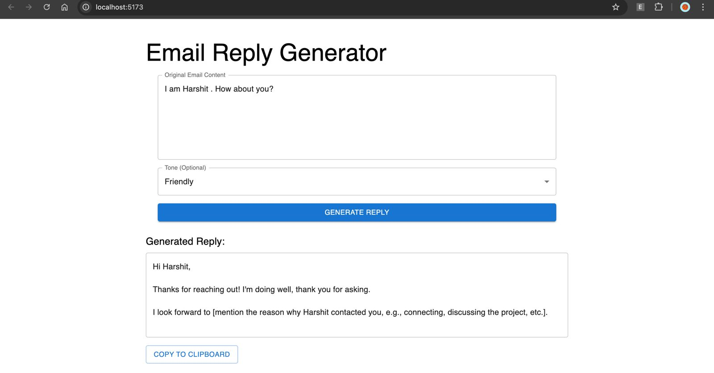

# Email Writer Project

A comprehensive email writing assistant that combines a Spring Boot backend API, React frontend, and Chrome extension to help users generate professional email replies using AI.

## 🏗️ Project Structure

This project consists of four main components:

### 1. **email-writer/** - Spring Boot Backend API
- **Technology**: Spring Boot 4.0.0-M1, Java 24, Maven
- **Purpose**: RESTful API that integrates with Google's Gemini AI to generate email replies
- **Key Features**:
  - Email reply generation using Gemini AI
  - Configurable tone settings (professional, casual, friendly)
  - RESTful endpoints for email generation
  - WebClient for external API communication

**Key Files**:
- `EmailGeneratorController.java` - REST controller handling email generation requests
- `EmailGeneratorService.java` - Service layer integrating with Gemini AI
- `WebClientConfig.java` - Configuration for HTTP client
- `EmailRequest.java` - DTO for email generation requests

### 2. **email-writer-react/** - React Frontend
- **Technology**: React 19.1.1, Vite, Material-UI, Axios
- **Purpose**: Modern web interface for email generation
- **Key Features**:
  - Clean, responsive UI using Material-UI components
  - Real-time email reply generation
  - Tone selection (professional, casual, friendly)
  - Copy-to-clipboard functionality
  - Loading states and error handling

**Key Files**:
- `App.jsx` - Main React component with email generation interface
- `package.json` - Dependencies including React, Material-UI, and Axios

### 3. **email-writer-ext/** - Chrome Extension
- **Technology**: Vanilla JavaScript, Chrome Extension Manifest V3
- **Purpose**: Browser extension that integrates with Gmail
- **Key Features**:
  - Direct integration with Gmail compose interface
  - One-click AI reply generation
  - Automatic email content extraction
  - Seamless reply insertion into compose box

**Key Files**:
- `manifest.json` - Extension configuration and permissions
- `content.js` - Content script that injects AI button into Gmail
- `content.css` - Styling for the extension

### 4. **hello-world-ext/** - Sample Extension
- **Technology**: Basic Chrome Extension
- **Purpose**: Simple example extension for reference
- **Key Files**:
  - `manifest.json` - Basic extension manifest
  - `hello.html` - Simple popup interface
  - `popup.js` - Popup functionality

## 🚀 Getting Started

### Prerequisites
- Java 24 or higher
- Node.js 18+ and npm
- Google Gemini API key
- Chrome browser (for extension)

### Backend Setup (email-writer/)

1. **Navigate to the backend directory**:
   ```bash
   cd email-writer
   ```

2. **Configure API keys**:
   Create `src/main/resources/application.properties` with:
   ```properties
   gemini.api.url=https://generativelanguage.googleapis.com/v1beta/models/gemini-pro:generateContent
   gemini.api.key=YOUR_GEMINI_API_KEY
   server.port=8080
   ```

3. **Run the Spring Boot application**:
   ```bash
   ./mvnw spring-boot:run
   ```
   The API will be available at `http://localhost:8080`

### Frontend Setup (email-writer-react/)

1. **Navigate to the React directory**:
   ```bash
   cd email-writer-react
   ```

2. **Install dependencies**:
   ```bash
   npm install
   ```

3. **Start the development server**:
   ```bash
   npm run dev
   ```
   The frontend will be available at `http://localhost:5173`

### Chrome Extension Setup (email-writer-ext/)

1. **Open Chrome and navigate to**:
   ```
   chrome://extensions/
   ```

2. **Enable Developer Mode**

3. **Click "Load unpacked" and select the `email-writer-ext` folder**

4. **The extension will now be available in Gmail**

## 📡 API Endpoints

### Generate Email Reply
- **URL**: `POST /api/email/generate`
- **Body**:
  ```json
  {
    "emailContent": "Original email content here",
    "tone": "professional" // optional: professional, casual, friendly
  }
  ```
- **Response**: Generated email reply as plain text

## 🔧 Configuration

### Environment Variables
- `gemini.api.url`: Google Gemini API endpoint
- `gemini.api.key`: Your Gemini API key
- `server.port`: Backend server port (default: 8080)

### Extension Permissions
The Chrome extension requires:
- `activeTab`: To access the current Gmail tab
- `storage`: For potential future data persistence
- `http://localhost:8080/*`: To communicate with the backend API
- `*://mail.google.com/*`: To inject content into Gmail

## 🎯 Usage

### Web Interface
1. Open the React frontend in your browser
2. Paste the original email content
3. Select an optional tone
4. Click "Generate Reply"
5. Copy the generated reply to your clipboard



*Screenshot showing the Email Reply Generator web interface with email content input and generated reply output.*

### Chrome Extension
1. Open Gmail in Chrome
2. Open an email you want to reply to
3. Click the "AI Reply" button in the compose toolbar
4. The generated reply will be automatically inserted into the compose box

## 🛠️ Development

### Backend Development
- The backend uses Spring Boot with WebFlux for reactive programming
- Lombok is used for reducing boilerplate code
- The service integrates with Google's Gemini AI API

### Frontend Development
- Built with React 19 and Vite for fast development
- Material-UI provides a consistent design system
- Axios handles HTTP requests to the backend

### Extension Development
- Uses Manifest V3 for modern Chrome extension development
- Content scripts inject functionality directly into Gmail
- The extension communicates with the local backend API

## 📁 File Structure Overview

```
email-writer-project/
├── email-writer/                 # Spring Boot Backend
│   ├── src/main/java/com/email/writer/
│   │   ├── app/
│   │   │   ├── EmailGeneratorController.java
│   │   │   └── EmailRequest.java
│   │   ├── EmailGeneratorService.java
│   │   ├── EmailWriterApplication.java
│   │   └── WebClientConfig.java
│   ├── pom.xml
│   └── mvnw
├── email-writer-react/           # React Frontend
│   ├── src/
│   │   ├── App.jsx
│   │   └── main.jsx
│   ├── package.json
│   └── vite.config.js
├── email-writer-ext/             # Chrome Extension
│   ├── manifest.json
│   ├── content.js
│   └── content.css
├── hello-world-ext/              # Sample Extension
│   ├── manifest.json
│   ├── hello.html
│   └── popup.js
└── email-reply.jpg              # Project screenshot
```

## 🤝 Contributing

1. Fork the repository
2. Create a feature branch
3. Make your changes
4. Test all components (backend, frontend, extension)
5. Submit a pull request

## 📝 License

This project is open source and available under the [MIT License](LICENSE).

## 🆘 Support

For issues and questions:
1. Check the existing issues in the repository
2. Create a new issue with detailed information
3. Include error messages and steps to reproduce

## 🔮 Future Enhancements

- [ ] Add email templates
- [ ] Support for multiple languages
- [ ] Email sentiment analysis
- [ ] Integration with other email providers
- [ ] User authentication and history
- [ ] Advanced tone customization
- [ ] Email scheduling features
